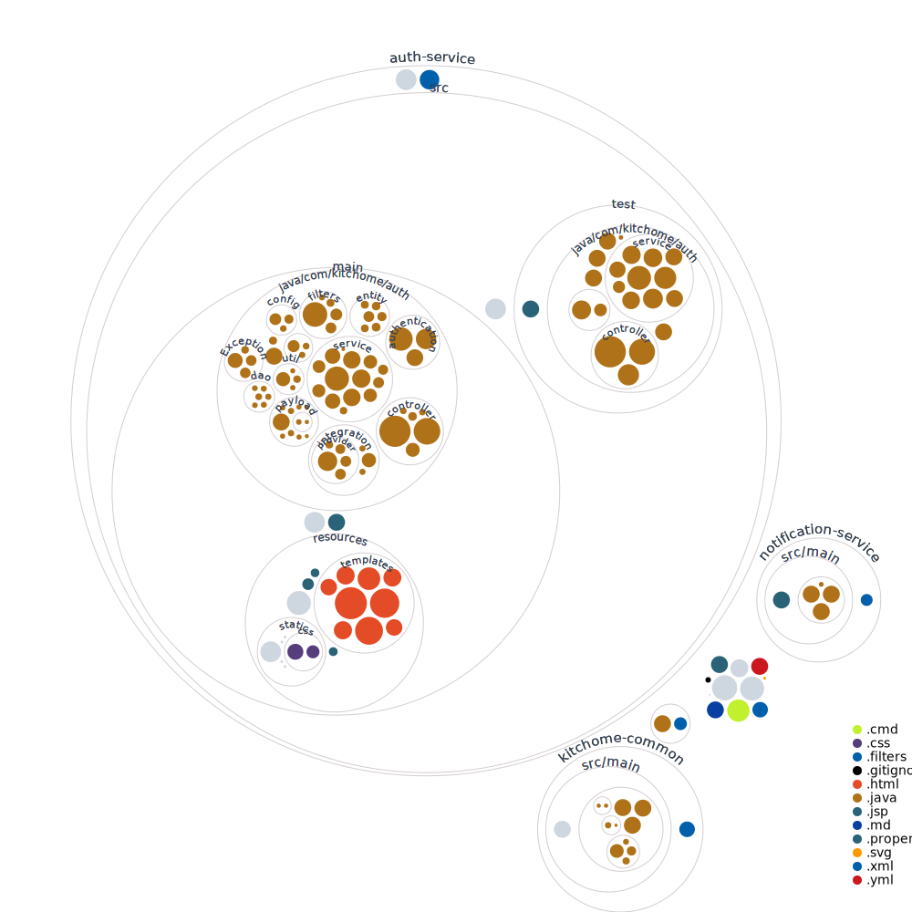
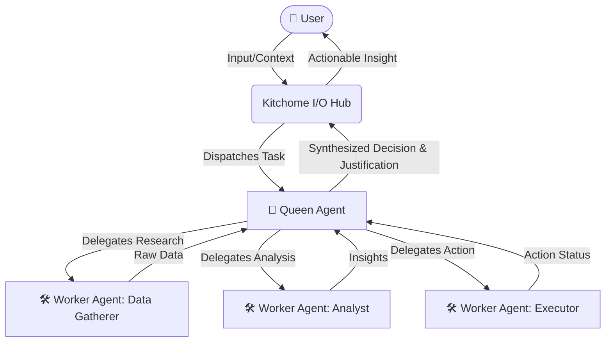
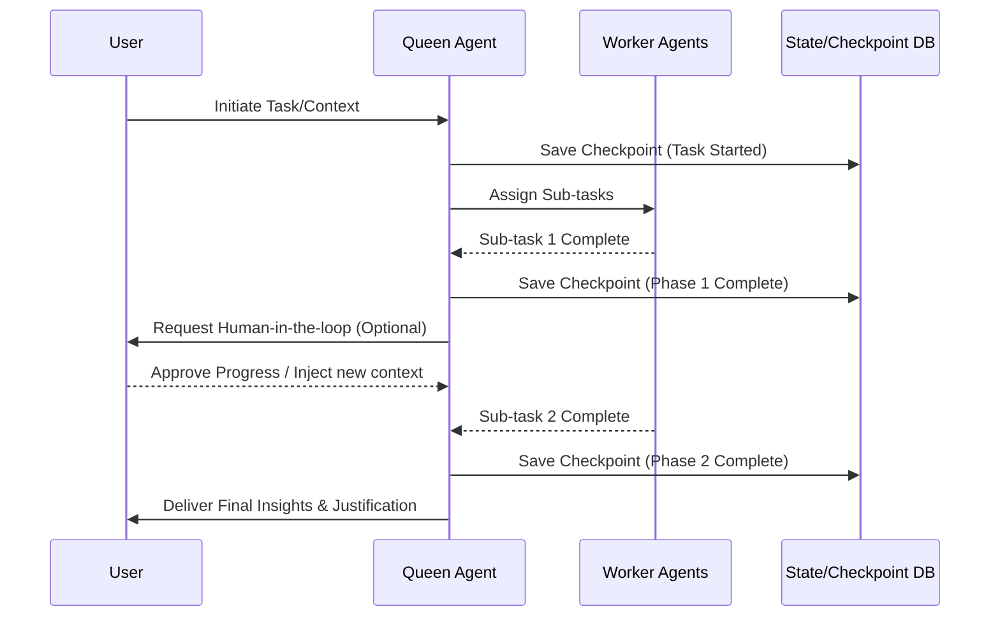

# Kitchome Platform

**Kitchome Platform** is an intelligent I/O hub designed to seamlessly bridge the gap between users and autonomous agents. Its primary mission is to simplify the complexities of daily life by generating actionable insights and providing strong, well-reasoned justifications for decision-making.



---

## 🌟 Vision & Purpose

In an increasingly complex world, making the right choices fast is critical. Kitchome acts as your personal command center, gathering context, orchestrating AI agents, and distilling vast amounts of information into clear, justified decisions.

- **Act as an I/O Hub:** A centralized platform where user inputs and real-world data meet agentic processing.
- **Ease Decision Making:** Transforms raw data into synthesized insights, reducing cognitive load for the user.
- **Provide Strong Justifications:** Every recommendation comes with transparent reasoning, so you can trust the decisions being made.

---

## 🚀 Key Features

### 1. Multi-Entry Points for Agents
Kitchome is built with flexibility in mind, offering multiple entry points and APIs for various specialized agents to connect, ingest data, and deliver outputs. 

### 2. Queen and Worker Orchestration
The platform employs a sophisticated hierarchical agent architecture:
- **Queen Agents:** Act as the brain of the operation, delegating tasks, synthesizing results, and ensuring the overall goal is met.
- **Worker Agents:** Specialized micro-agents dedicated to executing specific tasks (e.g., data gathering, analysis, integration with third-party services).



### 3. Checkpoint Session-Based Agent Workflows
To handle long-running and complex tasks, Kitchome supports robust, checkpoint-based sessions:
- **Stateful Execution:** Agent workflows can be paused, inspected, or resumed at specific checkpoints.
- **Resilience:** Ensures that long-running processes do not lose progress in case of interruptions.
- **Audibility:** Users can review the justification and intermediate steps at any checkpoint before proceeding to the final decision.



---

## 🛠️ Technology Stack (Current State)

Currently, the foundation of the Kitchome platform consists of a robust backend service architecture built with **Spring Boot**:

- **Authentication & Security:** JWT-based access flows with custom credential management for linking external third-party tools (Google Calendar, HubSpot, etc.).
- **Microservices Architecture:** Segregated into modules like `auth-service`, `user-service`, and `notification-service`.
- **Thread-safe Integrations:** Secure, asynchronous token refreshing and secret management using tools like Vault.

## 📦 Getting Started

```bash
git clone https://github.com/Saurabh1374/Complete-custom-auth.git
cd Complete-custom-auth
./mvnw clean package
java -jar auth-service/target/authentication-0.0.1-SNAPSHOT.war
```
